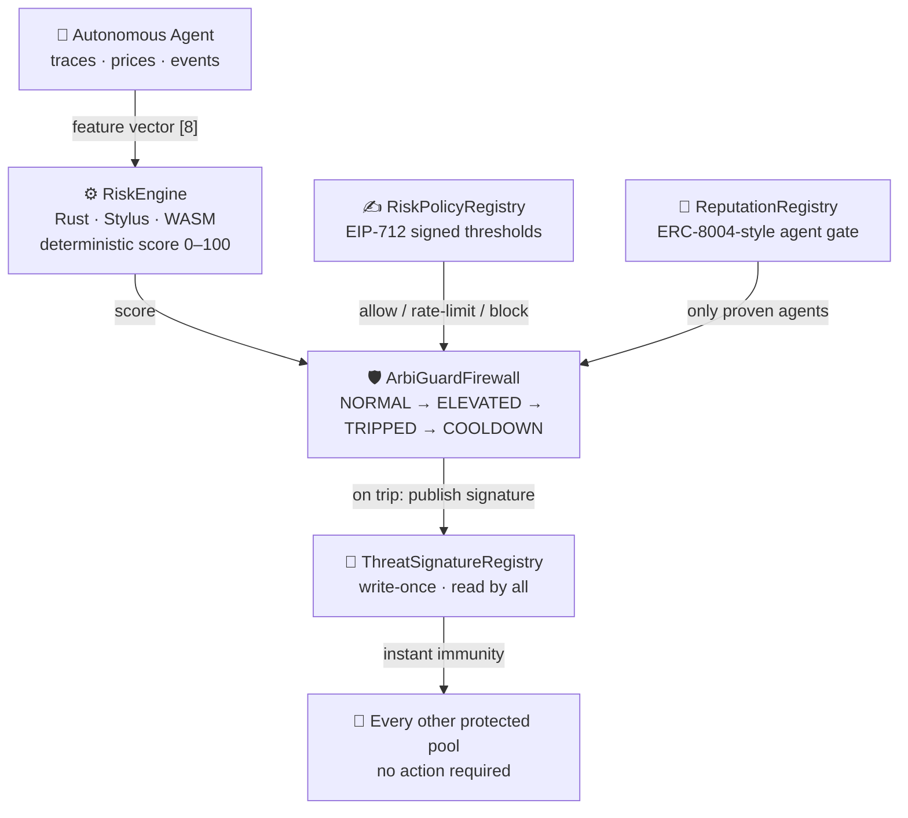

<div align="center">


# ArbiGuard

### The on-chain firewall for tokenized real-world assets

**Detect threats on-chain · Enforce cryptographically signed risk policies · Immunize every protected market at once**

<br/>

[](https://arbiguard.ibxlab.com/)
[](https://arbiguard.ibxlab.com/firewall)
[](https://youtu.be/GkLjD-UROP4)

[](https://arbitrum-sepolia.blockscout.com/address/0xad5230b558b8083f4b313f77c83d2765a78645b6)
[](https://explorer.testnet.chain.robinhood.com/address/0x4ad001282938b6b8cfb8850f69d80c8d9bbbeb75)
[](./contracts-stylus)
[](#-quality--testing)
[](https://hub.docker.com/r/aliveevie/arbiguard)
[](#-license)

<br/>

<a href="https://youtu.be/GkLjD-UROP4">
  
  <br/>
  <em>▶️ Watch the 90-second demo: the 2024 Radiant exploit replayed against the live firewall</em>
</a>

</div>

---

## 💡 Why ArbiGuard

Tokenized equities, treasuries, and funds are moving on-chain — and the venues that list them inherit DeFi's entire attack surface: flash-loan drains, oracle manipulation, sandwich extraction. For an institution, one exploited market is not a bad day; it is a regulatory event.

Traditional market infrastructure solved this decades ago with circuit breakers, signed risk policies, and shared threat intelligence. **ArbiGuard brings all three on-chain:**

| | TradFi market integrity | ArbiGuard on-chain equivalent |
|---|---|---|
| 🚦 | Exchange circuit breakers | Hysteresis breaker FSM — `NORMAL → ELEVATED → TRIPPED → COOLDOWN` |
| ✍️ | Risk-officer sign-off | **EIP-712 signed risk policies** — submitted by anyone, forgeable by no one |
| 📰 | ISAC threat bulletins (hours later) | **Write-once threat registry** — every protected market immune in the same block |
| 🪪 | Licensed market operators | **ERC-8004-style reputation gating** for autonomous agents |

---

## 🚀 Live Right Now

| Resource | Link |
|---|---|
| 🌐 **Live application** | **https://arbiguard.ibxlab.com/** |
| 📡 **Live firewall dashboard** (reads both chains every 15s) | **https://arbiguard.ibxlab.com/firewall** |
| ▶️ **Demo video** | **https://youtu.be/GkLjD-UROP4** |
| 📦 **Source code** | **https://github.com/aliveevie/arbiguard** |
| 🐳 **Docker image** (linux/amd64, server + UI in one) | **`docker pull aliveevie/arbiguard:latest`** |

---

## 🏗️ Architecture

One protocol, five contracts. The agent watches traces and prices off-chain, reduces each transaction to a canonical 8-element feature vector — and everything after that happens on-chain.



1. **Detect** — the risk engine scores the feature vector on-chain: flash-loan selectors, spot/TWAP deviation (1e6 fixed-point), sandwich bracketing, call-depth shape, liquidation/oracle correlation.
2. **Enforce** — the firewall runs the score through a hysteresis state machine whose thresholds come from a policy the pool's risk officer signed under EIP-712. A single anomalous block can never halt a market — tripping requires the anomaly to *sustain* across distinct blocks. During cooldown, the re-trip barrier drops to one block.
3. **Immunize** — a confirmed trip publishes the exploit's signature once (write-once, immutable). Every other registered pool rejects that signature from the same block onward — with zero transactions of its own.

---

## ⚙️ One Scorer · Three Runtimes · Bit-Identical

The exact same scoring math is implemented three times and proven equivalent — same weights, same thresholds, even JavaScript's `Math.round` semantics reproduced in integer arithmetic:

| Implementation | Where | Role |
|---|---|---|
| **TypeScript** | [`skill/detection/`](./skill/detection) | Real-time off-chain detection |
| **Rust → WASM (Arbitrum Stylus)** | [`contracts-stylus/`](./contracts-stylus) | On-chain source of truth |
| **Solidity** | [`contracts/src/RiskEngineSolidity.sol`](./contracts/src/RiskEngineSolidity.sol) | Reference / non-Stylus chains |

Parity is pinned against three historical Arbitrum exploits by **all three test suites**, and verified live on both deployed chains:

| Historical exploit | TS engine | Stylus on-chain | Solidity on-chain | Outcome |
|---|:---:|:---:|:---:|---|
| Radiant flash-loan (2024) | **73** | **73** | **73** | 🔴 block → breaker trips |
| GMX oracle manipulation (2022) | **63** | **63** | **63** | 🔴 block |
| Camelot flash drain (2023) | **30** | **30** | **30** | 🟢 allow (indicators flagged) |

If the implementations ever drift, CI breaks.

---

## 📜 Deployed Contracts

All Solidity contracts are **source-verified on Blockscout**. The Stylus engines are activated WASM contracts whose on-chain `score()` reproduces the off-chain scorer exactly on both networks.

### Arbitrum Sepolia · chain ID `421614`

| Contract | Address |
|---|---|
| ⚙️ RiskEngine (Stylus, Rust/WASM) | [`0x47f6e2dbb2dd913baef535b7aa744ee16d337e99`](https://sepolia.arbiscan.io/address/0x47f6e2dbb2dd913baef535b7aa744ee16d337e99) |
| 🛡️ ArbiGuardFirewall | [`0xad5230b558b8083f4b313f77c83d2765a78645b6`](https://arbitrum-sepolia.blockscout.com/address/0xad5230b558b8083f4b313f77c83d2765a78645b6) |
| ✍️ RiskPolicyRegistry | [`0x9171968d47e382a7387082512156502988b4b414`](https://arbitrum-sepolia.blockscout.com/address/0x9171968d47e382a7387082512156502988b4b414) |
| 🪪 ReputationRegistry | [`0x62b5bd6bce8c8df71b02432a3ad486a35719274d`](https://arbitrum-sepolia.blockscout.com/address/0x62b5bd6bce8c8df71b02432a3ad486a35719274d) |
| 📰 ThreatSignatureRegistry | [`0x1b0216bc1c5e57db9b2721ddacda107759b745aa`](https://arbitrum-sepolia.blockscout.com/address/0x1b0216bc1c5e57db9b2721ddacda107759b745aa) |
| ⚙️ RiskEngineSolidity (reference) | [`0x574388991f8a3e32f98789433541d5e3a6b39c21`](https://arbitrum-sepolia.blockscout.com/address/0x574388991f8a3e32f98789433541d5e3a6b39c21) |

### Robinhood Chain Testnet · chain ID `46630`

| Contract | Address |
|---|---|
| ⚙️ RiskEngine (Stylus, Rust/WASM) | [`0x4177bf2196151a05a51f7928988afd3fe7b6e949`](https://explorer.testnet.chain.robinhood.com/address/0x4177bf2196151a05a51f7928988afd3fe7b6e949) |
| 🛡️ ArbiGuardFirewall | [`0x4ad001282938b6b8cfb8850f69d80c8d9bbbeb75`](https://explorer.testnet.chain.robinhood.com/address/0x4ad001282938b6b8cfb8850f69d80c8d9bbbeb75) |
| ✍️ RiskPolicyRegistry | [`0xee702c8f5b1c13492f9ada978e9649fcf4771f75`](https://explorer.testnet.chain.robinhood.com/address/0xee702c8f5b1c13492f9ada978e9649fcf4771f75) |
| 🪪 ReputationRegistry | [`0x0b12480cb5db1f6605fe4ed206a0f6c29f86f85e`](https://explorer.testnet.chain.robinhood.com/address/0x0b12480cb5db1f6605fe4ed206a0f6c29f86f85e) |
| 📰 ThreatSignatureRegistry | [`0x07f821d0938ac1eb5b533d1ee735eddfabf36110`](https://explorer.testnet.chain.robinhood.com/address/0x07f821d0938ac1eb5b533d1ee735eddfabf36110) |
| ⚙️ RiskEngineSolidity (reference) | [`0x46e841b73c67d7e90bc629c3d4922c10661f8d6a`](https://explorer.testnet.chain.robinhood.com/address/0x46e841b73c67d7e90bc629c3d4922c10661f8d6a) |

> Machine-readable addresses live in [`deployments/421614.json`](./deployments/421614.json) and [`deployments/46630.json`](./deployments/46630.json).

---

## 🎬 The End-to-End Demo

[`demo/firewall-demo.ts`](./demo/firewall-demo.ts) replays the **2024 Radiant Capital flash-loan exploit** against the live deployment and walks the full autonomous response — watch it in the [demo video](https://youtu.be/GkLjD-UROP4):

```text
1/6  Radiant replay → canonical feature vector  [1, 1150000, 980000, 0, 4, 0, 1, 1]
2/6  On-chain Stylus score: 73 · parity with off-chain scorer: MATCH ✓
3/6  Score 73 CROSSES the signed block threshold (61)
4/6  Agent reports → ELEVATED → sustained across blocks → TRIPPED on-chain ✓
5/6  Threat signature published to the shared registry
6/6  Pool Beta — never touched — rejects the same signature: PROVEN ✓
```

Run it yourself against either chain:

```bash
# Robinhood Chain testnet
RPC_URL=https://rpc.testnet.chain.robinhood.com CHAIN_ID=46630 pnpm demo:firewall

# Arbitrum Sepolia
RPC_URL=https://sepolia-rollup.arbitrum.io/rpc CHAIN_ID=421614 pnpm demo:firewall
```

---

## 🖥️ Live Firewall Dashboard

The dashboard at [`/firewall`](https://arbiguard.ibxlab.com/firewall) reads contract state from **both chains every 15 seconds** — no mocks, no cache theater:

- 🟢🟡🔴 Per-pool breaker state badges (`NORMAL / ELEVATED / TRIPPED / COOLDOWN`)
- ⚙️ Scorer-parity tiles — on-chain vs. expected (73 / 63 / 30)
- ✍️ Signed policy thresholds per pool
- 📰 Published threat signatures with reporter and block
- 🪪 Agent identity, reputation, and gate status

Backed by `GET /api/firewall` — the same endpoint you can hit programmatically.

---

## 🧰 Quickstart

```bash
git clone https://github.com/aliveevie/arbiguard && cd arbiguard
pnpm install

# run everything locally (API + chat UI + dashboard)
pnpm dev                                   # → http://localhost:3000

# or run the published image — server + UI in one container
docker run -p 3000:3000 aliveevie/arbiguard:latest
```

Deploy your own stack (set `DEPLOYER_PRIVATE_KEY` in `.env` — see `.env.example`):

```bash
./scripts/deploy-testnets.sh               # Stylus engine + full stack on both chains
./scripts/verify-contracts.sh deployments/<chainId>.json
```

---

## ✅ Quality & Testing

| Suite | Command | Coverage |
|---|---|---|
| **Foundry — 62 tests** | `cd contracts && forge test -vvv` | FSM transitions (incl. *single-block anomaly does not trip*), EIP-712 signing/registration/enforcement, per-block rate limiting, reputation gating, write-once threat registry, Solidity engine parity |
| **Rust — 6 tests** | `cd contracts-stylus && cargo test` | Replay parity (73/63/30), JS-rounding-exact fixed-point math, indicator tiers |
| **Stylus validation** | `cd contracts-stylus && cargo stylus check` | WASM validates & activates (7.4 KB) on both chains |
| **Vitest — 28 tests** | `pnpm test` | Detection engine, TS↔on-chain parity, agent actions, live Sepolia integration |

Cross-language parity fixtures are generated from the TypeScript scorer (`pnpm gen:parity`) and consumed by the Rust suite — a single source of truth.

---

## 📂 Repository Layout

```
arbiguard/
├── contracts-stylus/        ⚙️ Rust RiskEngine for Arbitrum Stylus (cargo stylus)
├── contracts/               🛡️ Foundry: firewall, registries, reference engine, 62 tests
│   └── src/
│       ├── ArbiGuardFirewall.sol         hysteresis breaker FSM
│       ├── RiskPolicyRegistry.sol        EIP-712 signed risk policies
│       ├── ReputationRegistry.sol        ERC-8004-style agent gating
│       ├── ThreatSignatureRegistry.sol   write-once shared threat intel
│       └── RiskEngineSolidity.sol        reference scorer
├── skill/                   🤖 TypeScript detection engine, feature extraction, replays
├── server/ + arbiguard-ui/  🖥️ Express API + React app (chat agent + live dashboard)
├── demo/firewall-demo.ts    🎬 end-to-end exploit-replay demo
├── deployments/             📜 per-chain deployed addresses (JSON)
└── scripts/                 🔧 deploy, verify, parity codegen
```

---

## 🛠️ Stack

`TypeScript` · `Viem` · `Express` · `React` · `Rust / Arbitrum Stylus` · `Solidity 0.8.28` · `Foundry` · `OpenZeppelin` · `Vitest` · `Docker`

---

## 📄 License

MIT © [IBX Lab](https://ibxlab.com)

<div align="center">
<br/>

**🛡️ ArbiGuard — exploits end where the firewall begins.**

[Live App](https://arbiguard.ibxlab.com/) · [Dashboard](https://arbiguard.ibxlab.com/firewall) · [Demo Video](https://youtu.be/GkLjD-UROP4) · [GitHub](https://github.com/aliveevie/arbiguard)

</div>
